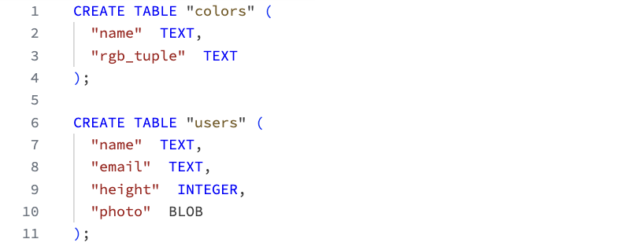
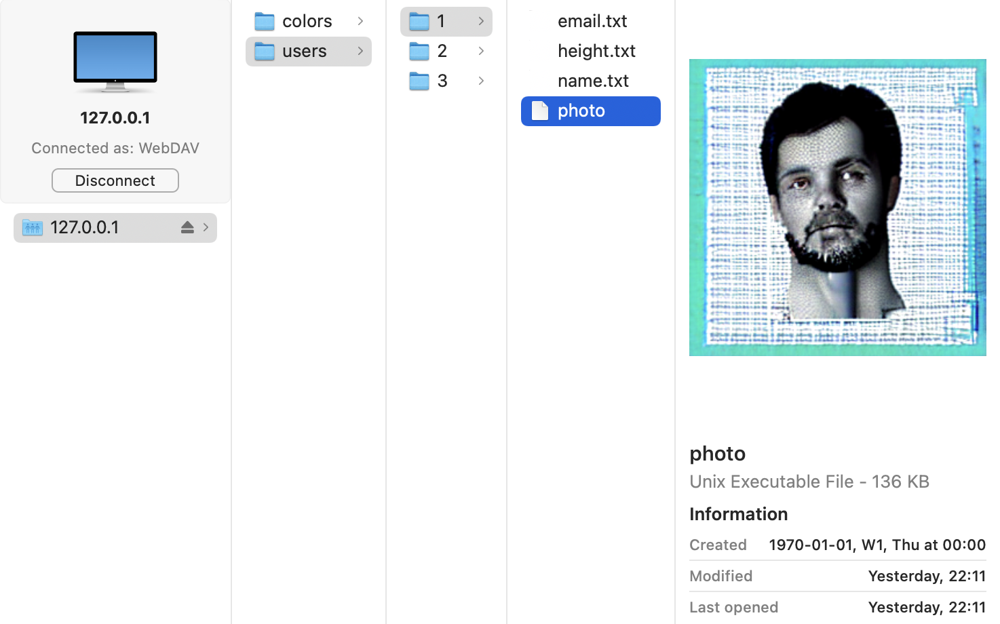

# SQLiteDAV

WebDAV server that maps an SQLite database to directories/files.

| | |
---|---
Database Schema | 
File View | 


## Installation

### From Binaries

1. Go to https://github.com/Airsequel/SQLiteDAV/releases
1. Download the latest release for your platform
1. Unzip the archive:
    ```sh
    unzip sqlitedav_*.zip
    ```
1. Make the binary executable:
    ```sh
    chmod +x sqlitedav
    ```


### From Source

Prerequisite:
[Install Stack](https://docs.haskellstack.org/en/stable/#how-to-install-stack)

```sh
git clone https://github.com/Airsequel/SQLiteDAV
cd SQLiteDAV
stack install
```


## Usage

1. Start WebDAV server:
    ```sh
    sqlitedav path/to/database.sqlite
    ```
2. Connect your WebDAV client to `http://localhost:1234` \
    (E.g. with macOS Finder by executing `cmd + k`)


## WebDAV Compliance

The repository ships a Dockerised setup for running the [Litmus]
protocol compliance test suite against a local SQLiteDAV instance.
It points Litmus at an empty sqlar archive so the test files it
creates do not collide with the committed fixtures.

```sh
make litmus
```

The target builds a small container image (Debian + `litmus`),
starts SQLiteDAV against a scratch database, and runs Litmus
against `http://host.docker.internal:1234/sqlar/`. Set
`LITMUS_PORT` to use a different port.


## Roadmap

The next features are implemented based on popular demand.
So please upvote any [issues](https://github.com/Airsequel/SQLiteDAV/issues)
you would like to see implemented!


## Related

- [Litmus] - WebDAV server protocol compliance test suite.
- [Many Hells of WebDAV] - Article about the discrepancies in WebDAV implementations.
- [sqlite-fs] - Mount a SQLite database as a normal filesystem on Linux and macOS.
- [sqlite.org/cloudsqlite][cloudsqlite] - Cloud backed SQLite system.
- [wddbfs] - [webdavfs] provider that can read sqlite databases.

[cloudsqlite]: https://sqlite.org/cloudsqlite/doc/trunk/www/index.wiki
[Litmus]: https://github.com/notroj/litmus
[Many Hells of WebDAV]: https://candid.dev/blog/many-hells-of-webdav
[sqlite-fs]: https://github.com/narumatt/sqlitefs
[wddbfs]: https://github.com/adamobeng/wddbfs
[webdavfs]: https://github.com/miquels/webdavfs
