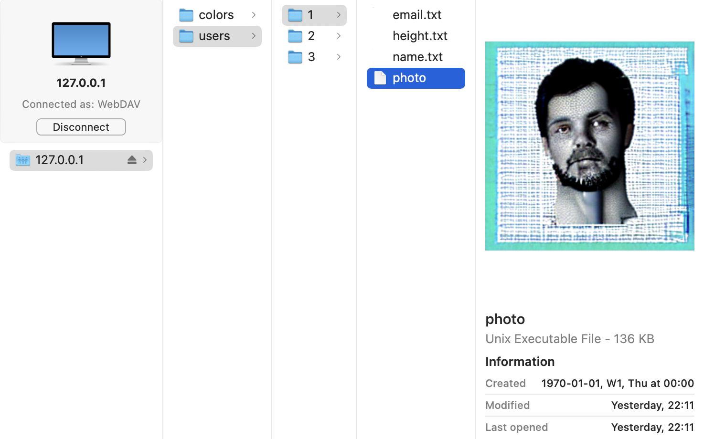

# SQLiteDAV

WebDAV server that maps an SQLite database to directories/files.

| | |
---|---
Database Schema | 
File View | 


## Installation

Prerequisite:
[Install Stack](https://docs.haskellstack.org/en/stable/#how-to-install-stack)

```sh
git clone https://github.com/Airsequel/SQLiteDAV
cd SQLiteDAV
stack install
```


## Usage

1. Start WebDAV server:
    ```sh
    sqlitedav --dbpath path/to/database.sqlite
    ```
2. Connect your WebDAV client to `http://localhost:1234` \
    (E.g. with macOS Finder by executing `cmd + k`)


## Roadmap

The next features are implemented based on popular demand.
So please upvote any [issues](https://github.com/Airsequel/SQLiteDAV/issues)
you would like to see implemented!
